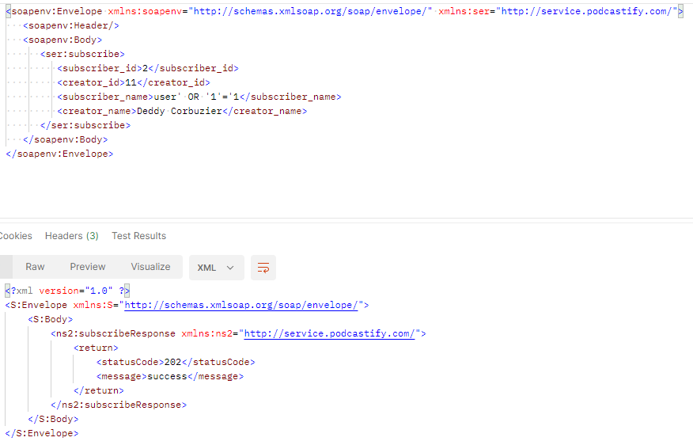
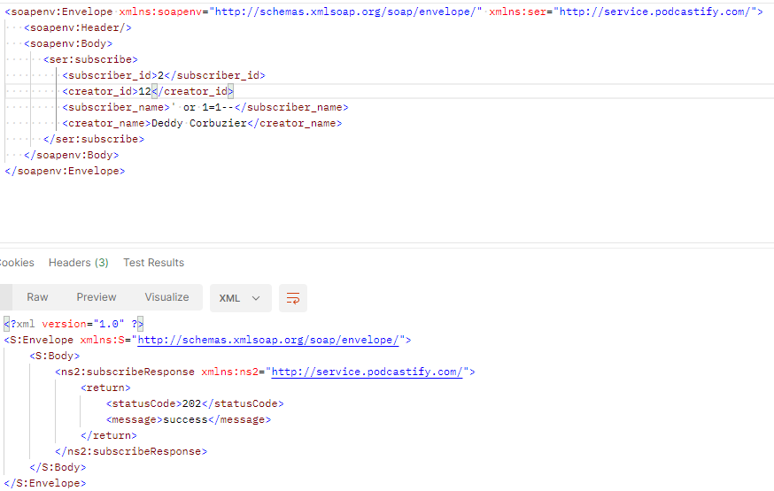
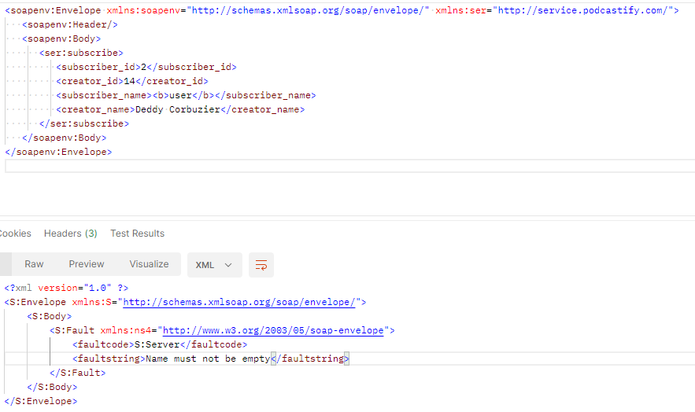

# OWASP
## 1. SQL Injection

SQL Injection is a code injection technique that attackers can use to exploit vulnerabilities in a web application’s database layer. This technique involves inserting malicious SQL statements into input fields for execution. To prevent this, we use parameterized queries or prepared statements, which can ensure that user-provided data cannot interfere with the query structure. Also, we always validate and sanitize user inputs

The images below show an example of a payload attack where a common SQL Injection pattern: 
```bash
' or 1=1--
``` 
and 
```bash
' OR '1'='1
``` 
is used. However, due to the use of parameterized queries and input sanitization, the SOAP service treats this input as a regular string rather than a part of SQL command. As a result, the SQL Injection command gets inserted as a regular subscriber name, demonstrating that the SOAP service is correctly mitigating SQL Injection attacks.




## 2. HTML and CSS Injection

HTML and CSS Injection is a type of attack where an attacker injects malicious HTML or CSS code into a web page, which is then rendered by the user’s browser. In our SOAP service, all string inputs are sanitized using `Jsoup.clean()` with `Safelist.none()`, which removes any HTML from the input. This effectively mitigates the risk of HTML and CSS Injection as it ensures that only safe and valid data is processed by our SOAP service.



## 3. File Upload Vulnerabilities

File Upload Vulnerabilities occur when an application allows file uploads without proper validation and sanitization, potentially allowing an attacker to upload malicious files. Our SOAP service does not have any file upload methods, and all inputs are either integer or string types. Therefore, it is not susceptible to File Upload Vulnerabilities.

## 4. HTTP Parameter Pollution

HTTP Parameter Pollution (HPP) is a type of attack where an attacker manipulates or injects HTTP parameters to cause changes in the application’s flow. Our SOAP service only has one endpoint and it only relies on parameters passed via SOAP envelopes. It does not use HTTP query parameters, so it is not susceptible to HPP attacks.

## 5. JWT / OAuth Attack

JWT/OAuth Attacks occur when an attacker exploits vulnerabilities in a JWT or OAuth-based authentication system. In JWT attacks, an attacker may attempt to modify the payload of the JWT to change the “claims” about the user, such as their role or permissions. In OAuth attacks, an attacker may exploit implementation mistakes such as not properly validating the redirect URI in the authorization request. Our SOAP service only accepts incoming requests from a valid private API key. If the API key is not valid, the request is unauthorized. This effectively mitigates the risk of JWT/OAuth Attacks as it ensures that only authorized requests are processed by our SOAP service.

